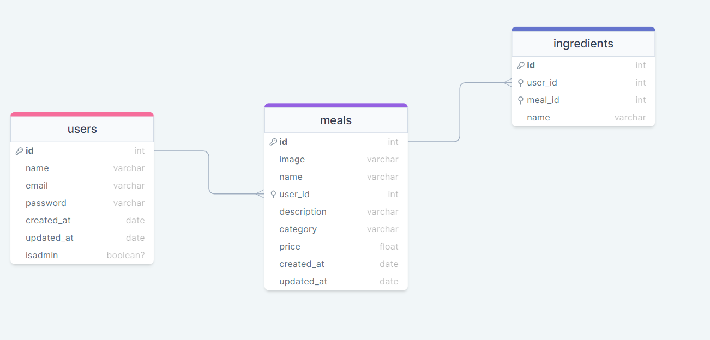

#  Food Explorer - BackEnd

Esta é uma aplicação de um estabelecimento fictício. Nela você pode, como administrador, fazer uma listagem das suas refeições, podendo criar pratos, editar, excluir e, com o login de usuário, listar/pesquisar pelos pratos existentes criados pelo administrador

<h1 align="center">
    
</h1>

## Sumário

- [Aviso](#aviso)
- [Sobre](#sobre)
- [Tecnologias](#tecnologias)
- [Funcionalidades](#funcionalidades)
- [Utilização](#utilização)
- [Autor](#autor)

</br>

## Aviso
- **USUÁRIO ADM** (
  email: henrique@gmail.com
  senha: 123456
)

- Embora o projeto tenha sido concluído, poderá haver aprimoramentos no futuro.

- Além disso, é possível fazer o download do repositório e executar a aplicação localmente.

- É possível testar a aplicação por meio deste link: [clicando aqui!](https://foods-explorer.netlify.app)


</br>

## Sobre

Este é o projeto final do programa Explorer da Rocketseat, que consistiu em desenvolver uma aplicação para gerenciar pedidos de um restaurante. A aplicação conta com três tipos de usuários:

- O usuário padrão que pode acessar a página inicial, buscar pratos por nome ou ingrediente, e ver informações detalhadas sobre os pratos.

- O usuário administrador que tem os mesmos privilégios do usuário padrão, além de poder cadastrar pratos, editar informações sobre os pratos e excluir pratos.


Abaixo, temos a modelagem do banco de dados:

<h1 align="center">
    
</h1>

</br>

## Tecnologias

-  Para a lógica de programação foi utilizado o **JS** ;
- **NodeJs** utilizado como ambiente para rodar o JS no servidor;
- Para lidar com as requisições HTTP o **Express** foi amplamente utilizado ;

- **Sqlite** é utilizado como banco de dados para armazenar os dados da aplicação;

- **Insomnia** para fazer os testes das solicitações HTTP

- **Knex** é usado para gerar comandos SQL e executá-los no banco de dados;

- **Jest** é utilizado para realizar testes de integração e garantir que a aplicação funcione corretamente;

- **Multer** é responsável por gerenciar o upload de imagens;

- **Git** é utilizado para versionar o código do projeto e manter um histórico de alterações


</br>

##  Funcionalidades

- [x] Mostrar todos pratos;
- [x] Mostrar um prato especifico;
- [x] Fazer a busca de um prato pelo nome;
- [x] Criar conta;
- [x] Fazer login;
- [x] Cadastrar um prato;
- [x] Editar um prato;

</br>


##  Utilização

- Comece clonando o projeto em sua máquina local:

  ```bash
    $git clone https://github.com/kinhoreis2000/BACK-END-FOODS-EXPLORER
  ```


- Em seguida, instale todas as dependências do projeto:

  ```bash
    $npm install
  ```
- Para adicionar o banco de dados, você precisa executar o seuginte comando:

  ```bash
    $npm run migrate
  ```

- Para rodar o servidor localmente, execute o seguinte comando:

  ```bash
    $npm run dev
  ```

- Se tudo estiver correto, você verá a mensagem abaixo no seu terminal/console:

  ```bash
    Server is running on port 3220.
  ```

- Agora você pode começar a usar os recursos da API, que estão disponíveis através da URL base:

  `http://localhost:3220`


## Autor

De autoria do desenvolvedor Luiz Henrique Reis. Veja meu [LinkedIn.](https://www.linkedin.com/in/luiz-henrique-reis-do-nascimento-8624b9161/)


_Caso encontre algum problema com o funcionamento de algum recurso, consulte esta documentação e tente novamente_

_Caso erros persistam, por favor,entre em contato com [kinhoreis2000@gmail.com](mailto:kinhoreis2000@gmail.com)._

